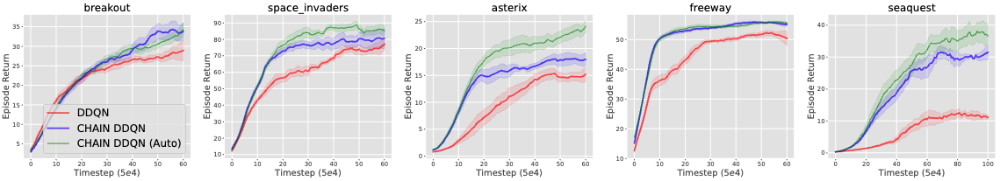
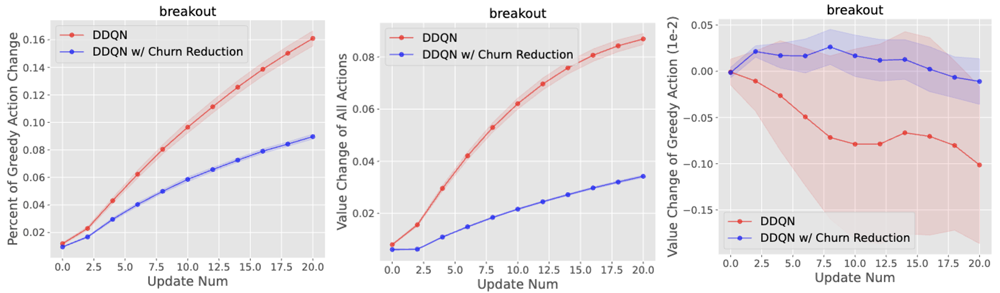
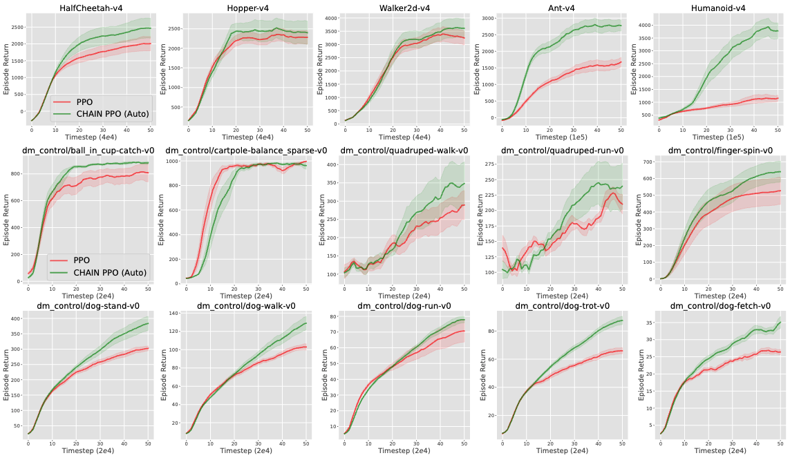
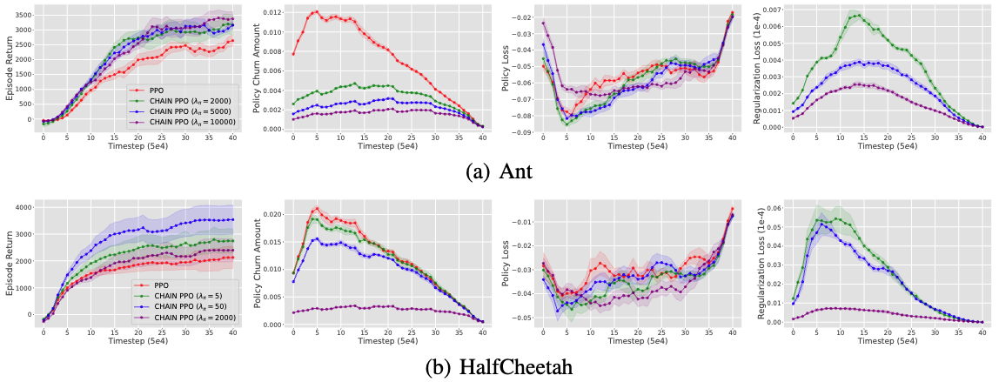
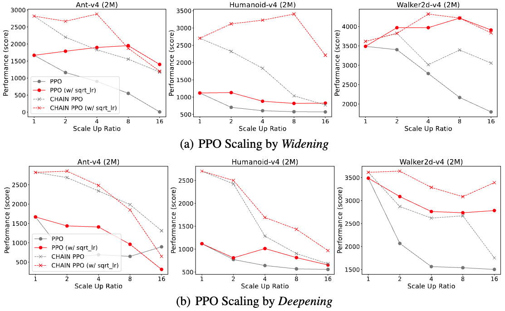
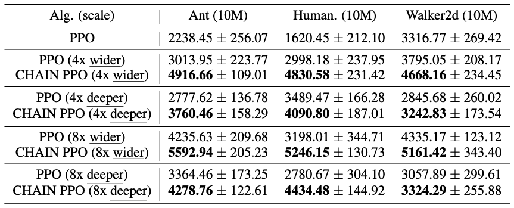

# CHAIN: Churn Approximated Reduction

---

The code implementation of Churn Approximated Reduction (CHAIN) for NeurIPS 2024 paper "Improving Deep Reinforcement Learning by Reducing the Chain Effect of Value and Policy Churn"


Please refer to our [paper](https://openreview.net/pdf?id=cQoAgPBARc#page=21.54) and [project page](https://bluecontra.github.io/CHAIN/) for more details.

---

### Running Environment Setups:

Since our codes are wirtten upon existing code bases (e.g., **MinAtar**, **MuJoCo/DMC Suite** from CleanRL, **D4RL** from CORL), one can run our code by following the installation of corresponding environments.
Then download our code and put into the running script folder.

We also provide the Dockerfile we used in ```./dockerfiles``` for reference. In practice, we mainly run with Apptainer (by building docker images first and converting them to Apptainer images).

For all our code implementations, we implement based on the corresponding code base with a slight re-organization of code structure (e.g., from single-file implementation to a bit modular). 
One can run the baseline method to verify the environment setups and then compare the scripts for the baseline method and its CHAIN version to see the difference.

#### MinAtar
For our experiments on MinAtar, we implement based on the original code provided in the official repo https://github.com/kenjyoung/MinAtar.
We recommend to follow the installation guidance of MinAtar env and then run our code provided in ```./minatar```.


#### DMC Suite

For our experiments on DMC Suite, we implement based on the original code provided in the official repo https://github.com/vwxyzjn/cleanrl.
We recommend to follow the installation guidance of DMC env in CleanRL and then run our code provided in ```./dmc```.

#### MuJoCo

For our experiments on MuJoCo, we implement based on the original code provided in the official repo https://github.com/vwxyzjn/cleanrl.
We recommend to follow the installation guidance of MuJoCo env in CleanRL and then run our code provided in ```./mujoco```.


#### CORL

For our experiments on DMC Suite, we implement based on the original code provided in the official repo https://github.com/tinkoff-ai/CORL.
We recommend to follow the installation guidance of D4RL env in CORL and then run our code provided in ```./corl```.

---

### Results

#### CHAIN DoubleDQN v.s. DoubleDQN @ MinAtar




#### CHAIN PPO v.s. PPO @ DMC & MuJoCo




#### Scaling Study of CHAIN




Please refer to our [paper](https://openreview.net/pdf?id=cQoAgPBARc#page=21.54) for complete results.

---
### Citation

```
@inproceedings{
  htang2024improving,
  title={Improving Deep Reinforcement Learning by Reducing the Chain Effect of Value and Policy Churn},
  author={Hongyao Tang and Glen Berseth},
  booktitle={Advances in Neural Information Processing Systems},
  year={2024},
  url={https://openreview.net/pdf?id=cQoAgPBARc}
}
```